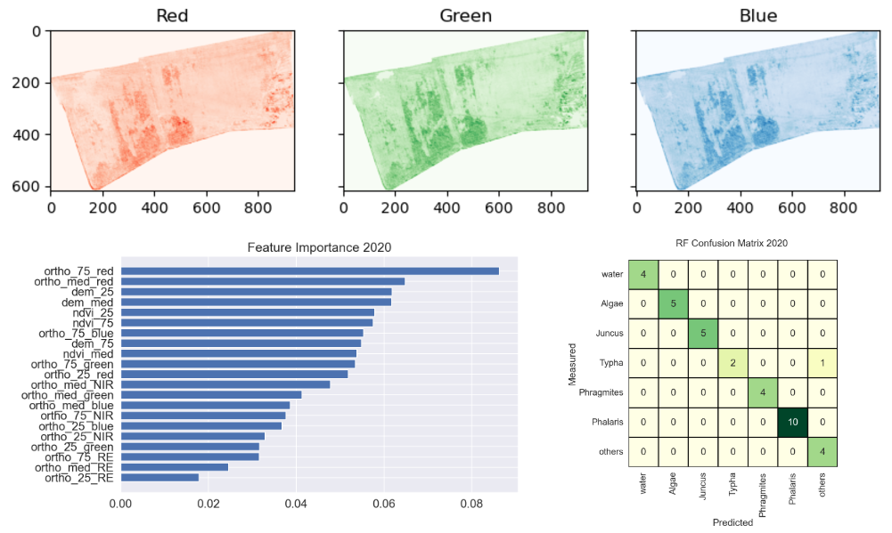

# Species mapping using Random Forest
 Mapping species in Neukalen, Germany from 2020 to 2022 using Python based on Random Forest classifier and UAV multispectral images

<h2>Credit</h2>

 👨‍🏫 The project developed by <a href='https://vietducng.github.io/'>Viet Nguyen</a> (<a href = 'https://geo.uni-greifswald.de/en/chairs/geographie/translate-to-english-fernerkundung-und-geoinformationsverarbeitung/translate-to-english-team/'>University of Greifswald | Institute of Geography and Geology</a>).

